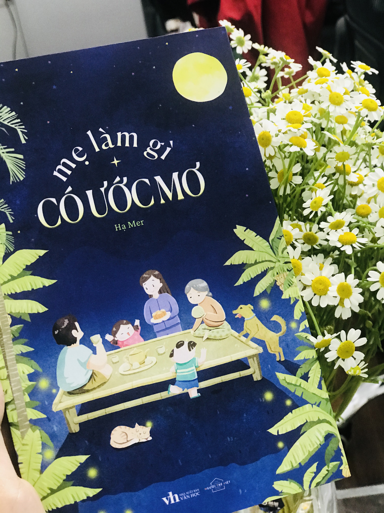

***Hanoi,19th April ,2023***
👧🏼:"Hồi trước, mẹ ước mơ là gì thế mẹ"

👩🏻:"Trước kia bà ngoại nhiều việc lắm đang ăn cơm chưa xong còn phải chạy đi học luôn, làm gì có thời gian mà nghĩ xem mình muốn gì"

👩🏻:"Đến lúc mẹ nghỉ học cô giáo vẫn tiếc vì mẹ cũng không phải người học kém, trước đây mẹ chỉ không học được môn Hoá thôi"

👧🏼:"Thế chắc con giống mẹ rồi, con cũng không thích học Hoá 😅"

Buổi tối nằm cạnh mẹ vu vơ hỏi mẹ một câu khi đang trong thời gian đọc quyển sách này📚

Một quyển sách như tái hiện lại những khoảnh khắc tưởng chừng như mình đã quên mất nó lâu rồi. Phong cảnh làng quê, con người nơi đó, những trò chơi của những đứa trẻ chẳng khác chỗ mình là mấy. Thậm chí cả những lần trách móc, những lần chẳng chịu hiểu cho bố mẹ cũng giống đến lạ.

