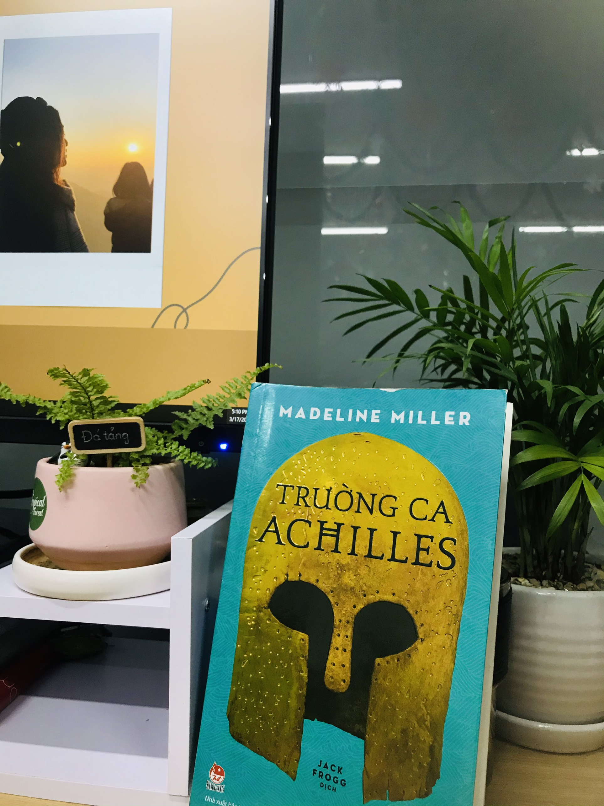

# The Song of Achilles_Madeline Miller

***Hanoi, Friday 17th March ,2023***

This is the first book I read in 2023, a friend recommended me ***The Song of Achilles***. At first I thought I might not be able to finish reading this book. There are two reasons for me to say that, the first is that it's too long and the second is that I've always thought Greek mythology would be boring to read. But to my surprise, I read it all without skipping a single page.
The story focuses on the love between two princes, Achilles and Patroclus, leaving me completely mesmerized by its beauty. They exhibited bravery and reciprocal kindness. Especially, their love is so strong that they never lie to one another.
Their story moved me to tears, and I will add it to my list of books that I absolutely love. ***The Song of Achilles*** is a great piece of work.

