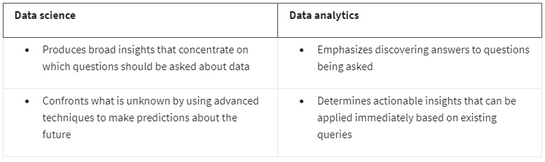

# ***Foundations of Data Science***

## ***Module 01: Introduction to data science concepts***

### What is data science vs. data analytics 

*Data Science* is entire field dedicated to making data more useful. A data scientist is a professional that uses raw data to develop new ways to model data and understand the unknown. Often, their job responsibilities incorporate various components of computer science, predictive analytics, statistics, and machine learning. The collections of information that data scientists work with can be quite large, requiring expertise to organize and navigate. 

*Data Analytics* is a subfield of the larger data science discipline. The aim of data analytics is to create methods to capture, process, and organize data to uncover actionable insights for current problems. Analysts focus on processing the information stored in existing datasets and establishing the best way to present this data. Data analysts rely on statistics and data modeling to solve problems and offer recommendations that can lead to immediate improvements. 

### The connections between data science and data analytics

- **Data science and data analytics** both aim to extract knowledge from data to help businesses grow.
- They work with data collected from measurable interactions.
- Companies are forming teams that combine data scientists and analysts to tackle complex data projects.
- These teams use similar tools and programming languages.
- The specific duties of each role depend on the company's resources and industry.
- The overlapping nature of the fields leads to interchangeable use of the titles in workplaces and job postings.

### The data professional in the data career space

This program uses different terms for data professionals:

- **Data professional:** refers to both data scientists and data analysts together.
- **Data analytics professional:** emphasizes roles focused on data analysis tasks.
- **Data career space:** encompasses all data science and related jobs.

These terms aim to be inclusive and cover the entire spectrum of data-related careers.

Different industries have different needs for data professionals, leading to variations in job responsibilities even with the same job title.

The program uses "data career space" as a broad term to capture all these diverse data-related career paths.