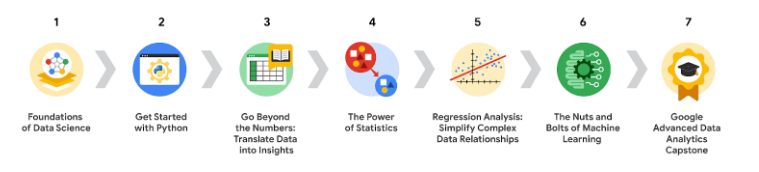
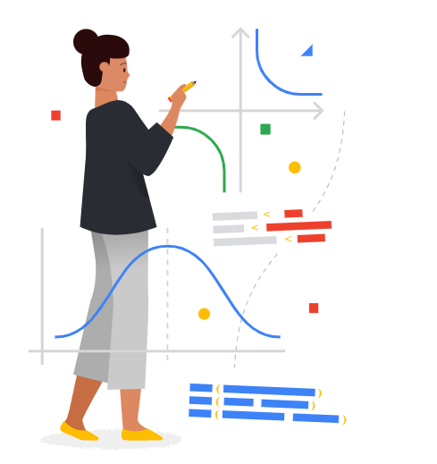
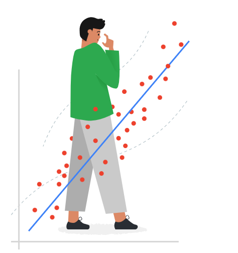

***Google Advanced Data Analytics Certificate***

# **Overview** 

The Google Advanced Data Analytics have seven courses. 

## *Course 1*: Foundations of Data Science

* Describe data science and its functions within an organization
* Identify tools used by data professionals
* Articulate the value of data science in organizations
* Investigate career opportunities for a data professional
* Explore data professional workflow
* Develop effective communication skills

## *Course 2*: Get Started with Python 

* Define what a programming language is and why Python is used by data scientists
* Create python scripts to display data and perform operations
* Manipulate and create strings, lists, dictionaries, and dataframes
* Import and use Python modules to access powerful functions and methods
* Demonstrate object-oriented programming using classes and objects

## *Course 3*: Go Beyond the Numbers: Translate Data into Insights

* Explain the process of exploratory data analysis (EDA)
* Apply Python tools to examine raw data structure and format
* Use relevant Python libraries for cleaning raw data
* Apply input validation skills to a dataset using Python
* Create visualizations using Tableau that tell the story of a dataset

## *Course 4*: The Power of Statistics

* Use descriptive statistics to summarize and explore data
* Apply basic probability concepts and probability distributions to analyze data
* Explain the theory, methods, and applications of sampling in inferential statistics
* Construct and interpret confidence intervals
* Perform and interpret hypothesis tests

## *Course 5*: Regression Analysis: Simplify Complex Data Relationships

* Understand relationships in datasets based on PACE
* Practice modeling simple and multiple linear regression
* Practice modeling binomial logistic regression
* Identify model assumptions
* Perform model evaluation and interpretation

## *Course 6*: The Nuts and Bolts of Machine Learning

* Identify characteristics of the different types of machine learning

* Recognize common IDEs, resources, and libraries

* Learn how to prepare data for modeling

* Build and evaluate supervised and unsupervised learning models

  * K-means and other clustering models

  * Different classification techniques such as decision trees, random forests, and gradient boosting

## *Course 7*: Google Advanced Data Analytics Capstone

* Develop a capstone project that applies skills learned from previous courses
* Examine data to identify patterns, trends, issues, and more
* Create models using machine learning techniques
* Compose data visualizations
* Review career resources
