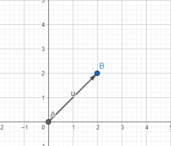
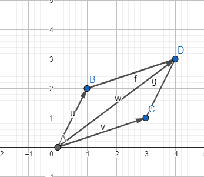
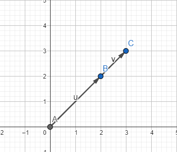
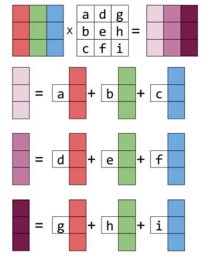

# Linear Algebra 

## I.Vector

### What is a vector?

***A vector*** is a quantity or phenomenon that has two independent properties: ***magnitude*** and ***direction***. 
***Vectors*** are special objects that can be ***added together*** and ***multiplied by scalars*** to produce another object of the same kind. 

*a, Example of Vector*

*b, Example of Added Vector*

*c, Example of Scale Vector*

### Vector Representation

Only 2D and 3D can use *geometric vectors*. How many *extra dimensions* would the vector have?

In n-dimensional space, the vectors will be represented as follows:
$$
a=
\begin{bmatrix}
a_1\\a_2\\a_3\\...\\a_n 
\end{bmatrix} \in R^n ,
v=
\begin{bmatrix}
1\\2\\3
\end{bmatrix} \in R^3
$$
In multidimensional space vectors also have two properties:*** addition and multiplication***:
$$
\begin{bmatrix}
a_1\\a_2\\...\\a_n 
\end{bmatrix}
+
\begin{bmatrix}
b_1\\b_2\\...\\b_n 
\end{bmatrix}
= \begin{bmatrix}
a_1+b_1\\a_2+b_2\\..\\a_n +b_n 
\end{bmatrix}, \quad
\alpha * 
\begin{bmatrix}
a_1\\a_2\\...\\a_n 
\end{bmatrix}
=\begin{bmatrix}
\alpha *a_1\\\alpha *a_2\\...\\\alpha *a_n 
\end{bmatrix}
$$

## II. Matrix

#### What is the matrix?

**Matrix** a [set](https://www.britannica.com/topic/set-mathematics-and-logic) of numbers arranged in rows and columns so as to form a rectangular [array](https://www.britannica.com/dictionary/array).
*Example of matrix*
$$
A =
\begin{bmatrix}
a_{11}&a_{12}&...&a_{1n}\\
a_{21}&a_{22}&...&a_{2n}\\
\vdots&\vdots&\ddots&\vdots\\
a_{m1}&a_{m2}&...&a_{mn}
\end{bmatrix} \in R^{m\times{}n}\\
\\
= concat(
\begin{bmatrix}
a_{11}\\a_{12}\\...\\a_{1n}
\end{bmatrix},
\begin{bmatrix}
a_{21}\\a_{22}\\...\\a_{2n}
\end{bmatrix},
...,
\begin{bmatrix}
a_{n1}\\a_{n2}\\...\\a_{mn}
\end{bmatrix})
$$

#### ***Matrix addition***

$$
A \in R^{m\times{}n},\quad B \in R^{m\times{}n}
\\
A+B=
\begin{bmatrix}
a_{11}+b_{11}&a_{12}+b_{21}&...&a_{1n}+b_{1n}\\
a_{21}+b_{21}&a_{22}+b_{22}&...&a_{2n}+b_{2n}\\
\vdots&\vdots&\ddots&\vdots\\
a_{m1}+b_{m1}&a_{m2}+b_{m2}&...&a_{mn}+b_{mn}
\end{bmatrix} \in R^{m\times{}n}
$$

#### ***Hadamard product***

$$
A \in R^{m*n},\quad B \in R^{m*n}
\\
A \bigotimes B=
\begin{bmatrix}
a_{11}b_{11}&a_{12}b_{21}&...&a_{1n}b_{1n}\\
a_{21}b_{21}&a_{22}b_{22}&...&a_{2n}b_{2n}\\
\vdots&\vdots&\ddots&\vdots\\
a_{m1}b_{m1}&a_{m2}b_{m2}&...&a_{mn}b_{mn}
\end{bmatrix} \in R^{m*n}
$$

#### ***Matrix multiplication***

$$
A \in R^{m\times{}n},\quad B \in R^{n\times{}k}, \quad C =AB, \quad C_{ij} = \sum^n_{k=1} a_{ik}b_{kj}
\\
\begin{bmatrix}
1&2\\2&0\\1&1
\end{bmatrix}
\begin{bmatrix}
2\\3
\end{bmatrix}
=\begin{bmatrix}
1\times{}2+2\times{}3\\2\times{}2+0\times{}3\\1\times{}2+1\times{}3
\end{bmatrix}
= \begin{bmatrix}
8\\4\\5
\end{bmatrix}
$$

*Different view*

​

*Example*
$$
\begin{bmatrix}
1&2\\2&0\\1&1
\end{bmatrix}
\begin{bmatrix}
2\\3
\end{bmatrix}
=2
\begin{bmatrix}
1\\2\\1
\end{bmatrix} + 3
\begin{bmatrix}
2\\0\\1
\end{bmatrix}
= \begin{bmatrix}
8\\4\\5
\end{bmatrix}
$$

#### ***Identity matrix***

Identity matrix is a square matrix, with the value:
$$
I_{ij} = 
\begin{cases}
1 &\quad \text{if } i=j \\
0 &\quad \text{if } i \neq j
\end{cases}
$$

$$
I_n=
\begin{bmatrix}
1&0&\cdots&0\\
0&1&\cdots&0\\
\cdots&\cdots&\cdots&\cdots\\
0&0&\cdots&1
\end{bmatrix} \in R^{n\times n}
$$

#### ***Matrix properties***

- $$
  \forall A \in R^{m\times n}, B \in R^{n\times p}, C \in R^{p\times q}: (AB)C = A(BC)
  $$

- $$
  \forall A, B \in R^{m\times n}, C, D \in R^{n\times p} \\
  $$

  $$
  \quad \quad \quad (A+B)C=AC + BC \\
  \quad \quad \quad A(C+D)=AC + AD
  $$

- $$
  \forall A \in R^{m \times n}: I_mA = AI_n =A, \text{note that }: I_m \neq I_n
  $$

#### ***Transpose***

$$
A \in R^{m\times n} \Rightarrow B = A^T \in R^{n \times m}, a_{ij} = b_{ji}
$$

$$
A =
\begin{bmatrix}
a_{11}&a_{12}&...&a_{1n}\\
a_{21}&a_{22}&...&a_{2n}\\
\vdots&\vdots&\ddots&\vdots\\
a_{m1}&a_{m2}&...&a_{mn}
\end{bmatrix}
\Rightarrow B =
\begin{bmatrix}
a_{11}&a_{21}&...&a_{m1}\\
a_{12}&a_{22}&...&a_{m2}\\
\vdots&\vdots&\ddots&\vdots\\
a_{1n}&a_{2n}&...&a_{mn}
\end{bmatrix}
$$

$$
\text{A matrix } A \in R^{m\times n} \text{is symmetric if } A^T = A
$$

#### ***Inverse***

Square matrix A and matrix B belong to the same n-dimensional space with the property that AB = BA = Identity matrix, then B is called the inverse matrix of A.

Not every matrix A has an inverse,if the inverse does exist, A is called regular/invertible/nonsingular matrix.
$$
A=
\begin{bmatrix}
a_{11}&a_{12}\\a_{21}&a_{22}
\end{bmatrix}
\Rightarrow A^{-1} = ?
$$

$$

$$

